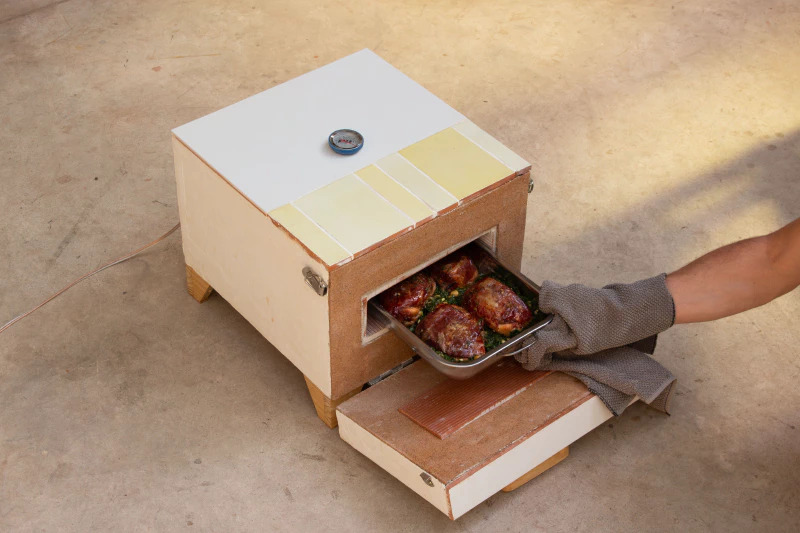
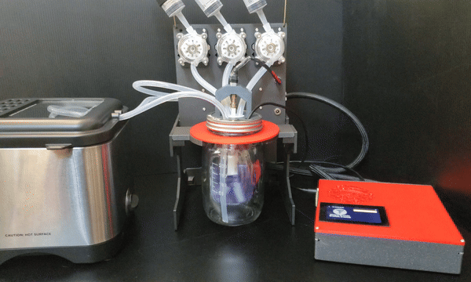
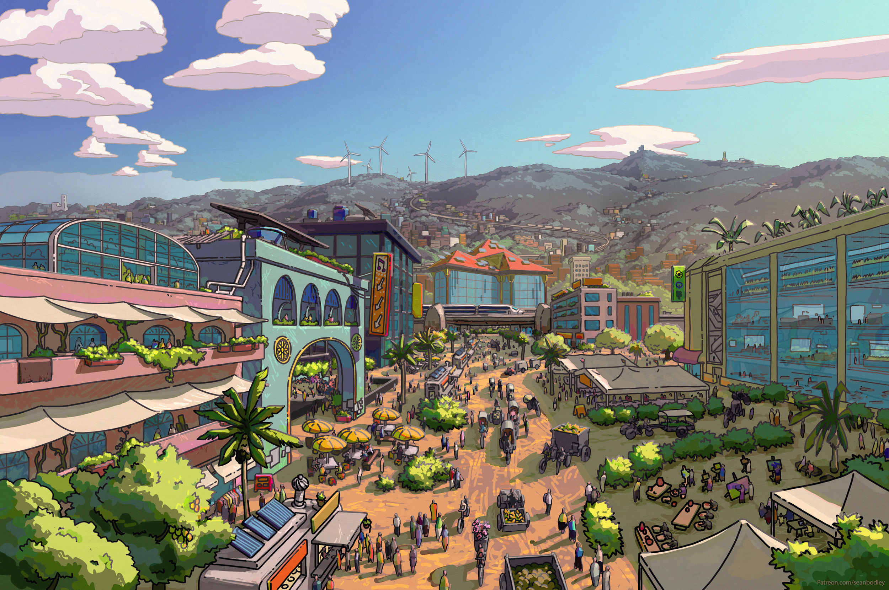

It's far from a controversial opinion nowadays that something is seriously wrong
with our world. We're having it screamed at us on every platform, in every feed,
by every person with an agenda, and even those without them, too. Across the
world, people are running and winning on any agenda that can be scrounged
together that talks about some kind of "change," whether that be Trump saying
that the change we need is more white supremacy, or Orban finally being ousted
from office.

But what I don't think we ever really do, is think of change in terms of what
kind of world, on a fundamental level, we want to see. There's lots of debate on
what kind of _policy_ we want, like Mamdani's public grocery stores, but very
few are really re-imagining the world in the public eye.

Right now you're probably a little lost, wondering what I'm even arguing for,
what would I have us do? To answer these questions, I first want to take a
deeper look at the world we have, and really illustrate what it looks like on a
broader level. I want to contrast the omnipresent dark image of our world with
the alternatives, or lack thereof, that exist. I then want us to practice a
little of what I call sociopolitical creativity.

What I am not going to do is argue for "the ideal world" that I crafted in my
head that I think is perfect, or argue that if everyone just conformed to that
idea then everything would be lovely. That's ridiculous, and in fact,
antithetical to what I want to do. As David Graeber wrote,

> the fantasy that ... the human condition, desire, mortality, can all be
> somehow resolved seems to be an especially dangerous one, an image of utopia
> which always seems to lurk somewhere behind the presentations of Power and the
> state. (_Fragments of an Anarchist Anthropology_, 31)

Instead, I'm going to give you a plurality of images, none perfect, all leaving
something to be desired. My hope is that these illustrations of creativity will
not just demonstrate that "a better world is possible," but jumpstart your
imagination and **enable you to begin the work of building that better world in
your own life.** I don't want to build a world for you. I don't want to teach
you what the world should look like. Really, what I want to do here is to offer
you a series of windows into the possibilities that exists beyond our world. I
want to inspire you, and begin to build a new world together, today.

## "Another World is Possible"

> It might possibly turn out that such a world is _not_ possible. But one could
> also make the argument which makes a commitment to optimism a moral
> imperative: **Since one cannot know a radically better world is not possible,
> are we not betraying everyone by insisting on continuing to justify, and
> reproduce, the mess we have today?** (David Graeber, _Fragments of an
> Anarchist Anthropology_, 10, bold added)

I have the probably less radical than expected take that our society is quite
literally accelerating towards its own demise. Imperialism has always been
inherently unsustainable and self-destructive (this is seen over and over again
in both the archeological and historical records), but European (and later
American, Soviet, and Maoist) empire has taken this habit of empire to an
incredible new level with industrial mechanisms of extraction and coercion.
We've literally engineered a society that is incentivized to maximally destroy
the world we inhabit by forcing people across the world to destroy their bodies
and minds with both production and consumption.

This is bad on its own, but thankfully, if there's one thing people are good at,
it's destroying the society they've built and doing things a new way. The
problem is, if there's one thing empire is good at, it's justifying its own
existence.

Ask pretty much anyone on the street, they'll probably tell you that, yeah, the
world kinda sucks, but it's more or less the best one we can have, even if we
can change it in subtle ways like building out "green" mass production instead
of relying on coal, or trying to distribute wealth downwards a bit more. The
core structure of society is never in doubt―for sure, "we" (actually they'll
always point to a _someone else_) need to be controlled to continue growing the
amount we produce, for some reason, whether that be so we can colonize space, so
that we can consume more things, or nicer things, so that we can eventually have
"fully automated luxury gay space communism," or just because, well, that's
life.

The details are all really in flux, especially now, but the core ideology is
never questioned: **we are not capable of organizing or coordinating ourselves,
and we could not survive without being controlled.**

David Graeber's argument above is one such rejection of this hegemonic ideology.
Mine is a bit more simple: we've already done it. I don't mean the "ideal world"
lies in the past, but that humans, across time and space, have done all the
things I think we should try to do. Societies have lived through and rejected
empire, have seen the face of states and displaced it with more socioecological
forms of coordination, we've been incredibly inventive and made things to
radically alter our lives and make it more abundant and easier without relying
on exploitation. This is exactly what I find so useful in the anthropological
method―**the more we look outside of our own world, the more we look outside of
what our society has been telling us is possible, the more possible another
world looks.**

"Solarpunk Anarchy," by Sean Bodley, CC BY-SA 4.0

What I am really proposing here is not one kind of imagery I want to put in your
head and then put on the ground. What I am proposing instead is that _you_ are
capable of imagining another world if only we cultivate these skills, and that
it is only when _we_ imagine these things and try our best to experiment with
what we can create can we truly exist in a new world.

### Expanding Politics

I've suggested that what makes us so special as a species is our capacity for
constant re-imagination of society, and doing the work of destruction and
reconstruction that goes along with that. But I want to go farther: I want to
argue that **"politics" is really how humans conduct the formation and
reformation, or, if you prefer, the organization and reorganization, of society
through both language and practice.** And, I want to argue that the reduction of
politics to policy has redirected this incessant desire of ours―to reformulate
our social rules, structures, and patterns―into the state, and that this has
resulted, ironically enough, into a nullification of this habit.

I want to take a look at three examples, two from the archaeological record, and
one from the historical one, of humans trying new things. Sometimes they
succeed, sometimes they don't. Sometimes its in a direction I think is good,
sometimes we don't even know what direction they're in. But in all of them, I
think we'll find something new about what we think we know about human society.
Each of these examples are about a city that has been rendered in an radically
new way. We'll look at an ancient city in Ukraine, contructed in a way that
isn't supposed to be possible, then we'll take a look at a capital in the Andes
hundreds of years ago, destroyed by revolution, and finally, we'll take a look
on our doorstep at a short-lived attempt at freedom with-out the state.

### A Tale of Three Cities

#### Tiwanaku & Cultural Revolution

What does it mean for an empire to collapse? Is it for the full weight of its
might to come crashing down upon itself, for devestating outside influences like
ecological shifts or the invasions of "barbarians" to wreak havoc? Does it spell
certain doom and a coming of dark times that must be feared? If you think about
it, isn't it a bit strange that the collapse of the Roman Empire is something
mourned? The Romans were expansionists, enslavers, conquerers, patriarchs,
aristocrats―why would we identify with them, cheer on their success, and mourn
their failures?

Tiwanaku was an empire in Bolivia, in the Andes, that grew around when the Roman
Empire fell, in 500AD, lasting five-hundred years. That's quite the
timescale―for reference, the American Empire has existed for only half that.
Archaeologists have been digging up its capital, Tiahuanaco,[^8] uncovering its
secrets. Tiahuanaco, too, is a bit of a mystery, because it appears it was
steadily abandoned over the course of a few hundred years, before it was
ultimately destroyed.

[^8]: It's standard convention to refer to the empire itself as Tiwanaku, and
    the capital as Tiahuanaco, although they're technically supposed to be
    pronounced the same, the latter is just the Hispanicized version.

But the flows of change weren't just in its death, but also in its life. The
eclectic construction of monuments and architecture at Tiahuanaco suggests that
reconstruction was just as intimate to its role as a place of ceremony as its
construction, with monuments and buildings constructed and reconstructed to fit
the changing mythos that underlied Tiwanaku's social power (Vranich 2006).

Eventually, not only does reconstruction seem to be a part of its ritual, but
destruction, too. What were once socially-central monuments in this ceremonial
city, that conveyed the power of the empire, were now being destroyed, torn
down, even in coordinated efforts. It'd be like if people in Washington D.C.
started tearing down the Washington Monument. All evidence seems to point to the
idea that the people who once inhabited Tiahuanaco revolted, tearing down the
monuments that presented as socially authoritative (Janusek 2004).

But this idea is actually a fairly new one. That might surprise you, because
when you have giant monoliths torn down with no apparent salvaging, and the next
great power in the region admiring these monuments and narrativizing themselves
as the continuation of Tiwanaku, and you have evidence the Spanish were _not_
involved in this destruction either, it begs two important question: 1) Why were
these monuments torn down, and 2) What happened to Tiwanaku?

Around this time, there were in fact environmental changes that probably had a
part to play in Tiwanaku's collapse. And this is what archaeologists previously
had reduced it to―bad luck. How unfortunate that the environment changed and the
empire collapsed. This renders the people of Tiwanaku to be politically benign,
or apolitical agents, and coincidentally. The people of Tiwanaku, like the
people of America, are not seen as political actors, only political objects.

The dominant conception of politics is that it is something that happens only
within the state. But this idea also carries with it the flipside of the coin,
which is that normal people are incapable of politics. If politics is only in
the state, then it goes unsaid that politics also cannot be done by people
outside the state, or especially against the state unless it is from another.
What that means for Tiwanaku is that it seemed unfathomable that normal people,
unless it was some kind of violent, evil mob, couldn't possibly decide that this
empire was no longer for them, and became angry and destroyed the monuments to
their subjegation.

We actually don't know their intentions or if they had any ideological backing.
The societies that followed were not especially egalitarian or liberatory. But
we do think that the collapse of Tiwanaku was no accident, no coincidence, it
was not seen as a devastating loss by the people in the region, and that it was
in fact an active choice that was undertaken through coordinated attempts at
dismantling an oppressive regime of empire.

How our society generally understands politics renders this outside of politics,
and thus a thoughtless, intentionless act. But isn't this ridiculous? **Why
would we assume the dismantling of an empire was apolitical merely because they
did not choose to build another empire in its place?** The conclusion we have to
draw from this is that politics goes beyond statecraft, beyond empire-building,
and instead can be the very act of destroying the state, destroying empire―of
not just the crafting of states, but the dismantling of them, too.

#### The 1919 Seattle General Strike

The last city we're going to look at is one that is more familiar to us, and has
a history of radicalism. Shortly after the Great War, as it was called then,
workers in Seattle escalated from a shipyard workers' strike for better wages to
a full-blown general strike that shut down wage labor, the state, and policing
in the city. Laborers, with the exception of firemen, stopped working at their
jobs and started working for each other.

> **Every day thirty thousand meals were prepared in large kitchens, then
> transported to halls all over the city and served cafeteria style** ... A
> Labor War Veteran’s Guard was organized to keep the peace. On the blackboard
> at one of its headquarters was written: “The purpose of this organization is
> to preserve law and order without the use of force. No volunteer will have any
> police power or be allowed to carry weapons of any sort, but to use persuasion
> only.” (Howard Zinn, _A People's History of the United States_ 1980, 350-351)

People were fed, the streets were clean, and work was organized peacefully and
without coercion. They worked not for someone else but for each other. The
presumption that most people go into when they hear about these ideas is that
they're just that, ideas. But they're not. They're practices that have been
experimented with in our very own society, but have been squashed before we
could even see where they went. The result of this is that nobody thinks these
kinds of practices could possibly work, because the dominant narratives are that
we need authority and violence to keep us in line, and we've never been allowed
to push beyond this and experiment outside of these narratives.

I want to put this experiment in contrast to the previous two we looked at. In

> During the strike, crime in the city decreased. The commander of the U.S. army
> detachment sent into the area told the strikers’ committee that **in forty
> years of military experience he hadn’t seen so quiet and orderly a city.**
> (Zinn, 1980, 351)

Over a hundred years ago, there was enough class solidarity in Seattle to create
a state of anarchy until it was ended when thousands of special deputies,
sailors, and marines were brought in (Zinn 351). For the people of Seattle at
this time, politics was redefined as not merely working within the state, not
even merely fighting against the state, **but in fact building something new,
building a new world and defending it against the old.** And it was this
building, not merely the opposition, that was so terrifying for capital:

> The common man … losing faith in the old leadership, has experienced a new
> access of self-confidence, or at least a new recklessness, **a readiness to
> take chances on his own account** … authority cannot any longer be imposed
> from above; it comes automatically from below. (Zinn, quoting _The
> Nation_, 352)

What does it look like when we find the self-confidence to "take chances on
[our] own account"? It is notable that what was so threatening was not the
taking up of arms, it was not the vanguard of a revolution armed with the tools
of violence seizing the weapons of the state, it was not the threat of an open
guillotine waiting for its next victim―it was the confidence to organize, the
capacity to cooperate, the logistics of bread. **It was the fact that when they
seized the city, they put down the guns, not picked them up.**

To put down the guns is to refuse the tools of fear and distrust. Our world
has been ordered on the idea that we, collectively, are inherently dangerous,
inherently violent, inherently distrustful. We have lost such faith in one
another that the most important thing a child is taught is "don't talk to
strangers," i.e., do not trust your neighbor, be distrustful of all. To have
faith in each other is seen as dangerous, a risk that can never be taken. And
isn't this why we have the police? Isn't this why we have law, and order, and
force? Isn't this why, if you ever suggest that we do not need to be controlled
by violence to organize, to build a safe, strong, successful society, you'll
get inquistive reactions at best, contemptful reactions at worst? We learned
this as a child: the people of Seattle cannot govern themselves. But they can.

Revolution has been written as a transferrance of who holds the guns. Who is
aiming the gun at our head, at our friends' and neighbors' heads, at our children's
heads? It has been so normalized, so universalized, that we can't even imagine
what it would be like to put down the guns. And when it is so difficult to imagine,
we rationalize why it is so difficult―surely it must be because it is impossible,
a foolish goal, a naive means. Is it so foolish to have faith in one another, to
have faith in our self?

#### Ukrainian Megasites: Cities Without Kings

In the 4th millenium BC, a set of urban dwellings―what we might call cities―were
inhabited for around eight centuries, which, for cities in this era, was really
quite abnormal. But what is even more abnormal is the fact that, unlike most
(well known) cities, there have been no ceremonial, administrative,
fortification, or even monumental architecture or buildings found. It appears
that these cities were entirely ungoverned, or at least, lacked a central power
apparatus. It's notable that these things aren't found, because archaeologists
are very well equipped to look for these things, seeing as we've seen them all
over the world, all over time. In fact, we're predisposed to assume we'll find
_something_, to have our bias confirmed, so when everything we thought we knew
about cities turns up to not be true here, something's up.

The prevailing belief about cities is in line with an argument thought of by
Jean-Jaques Rousseau. According to Rousseau, humanity was blissfully ignorant,
free, and equal for much of human history, living in small bands of
hunter-gatherers. Then, he says, these people (he would've actually used the
term "savages") developed technologies like agriculture, metallurgy, and others,
requiring social organization, and settlement. Thus, he says, they chose to
create private property, hierarchy, and social control, until the land had been
divided up, at which point we would begin to fight each other.

This idea of course, rests on the assumption that all humans develop in a linear
kind of way, approaching the kind of society he was familar with. It also rests
on the idea that we are incapable of socially organizing without coercion. If
this was true, then we probably would never see any kind of large scale
organization, such as a city, without this coercion; **if we needed to be
controlled to work together, we should never see people successfully working
together without being controlled.**

But if academics, and especially people more broadly, are so stuck in the assumption
that people cannot organize without authority, evidence that continues to turn up
is going to be lost in translation, left out by theorists who don't know
how to understand what they're looking at, stuck in a paradox where theory fails
to grapple with reality.

> Even more, perhaps, [the slow integration of this finding by academics] had to
> do with the internal political life of the prehistoric settlements themselves.
> That is, **according to conventional views of politics, there didn't seem to
> be any.** No evidence was unearthed of centralized government or
> administration―or indeed, any form of ruling class. (_The Dawn of
> Everything_, 289)

By the _conventional views of politics_, they didn't have any, because we assume
politics to be the art of navigating control of tools of violence, not the
coordination of navigating complex consensus based decision making, or
experimenting with different social forms. But isn't this kind of ridiculous?
The presumption here is that these kinds of societies are more simple, because
they have not yet figured out the politics of the state, but aren't these complex
webs of debate and consensus worthy of consideration?

> Why do we assume that people who have figured out a way for a large population
> to govern and support itself … without overt displays of arrogance,
> self-abasement and cruelty―are somehow less complex than those who have not?
> (290)

Archaeological evidence in the region has shown that the city was defined by its
variation and diversity, rather than by its uniformity and conforming. Each home
as its own "constant innovation, even playfulness," with its "own unique
aesthestic style" (294). Households could vary from single families, to even
clusters as high as ten families in a home. Apparently, there was no template
that was instituted on every household, no "nuclear family" that was
universalized and mandated, only the flow of variation, change, and consensus
arising "from the bottom up, through processes of local decision-making" (295).

Politics is often positioned as a uniquely post-Enlightenment thing, with
everything before being necessarily determinist, only to bring us to this point
where we could possibly have something like the American or French Revolutions,
only so then we could finally begin to think about how to structure society,
only to then develop something like human rights which can end all questions of
politics. But thousands of years ago, people were doing things that we seem to
think is impossible today, and at the center of it all was not uniformity, but
fluidity. 

If we take a detour from the archaeological site for a moment, I want to try and
imagine what a city without administration, without policing, without politicians,
might look like. I imagine a city that is eclectic and messy, experimental and innovative,
fragmented and diverse. Perhaps neighborhoods band together councils or simply
meetings to plan festivals, feasts, or design streets, transportations, or caravans.
In absence of large-scale farming, small gardens could line the streets, overflow balconies,
cover roofs. I imagine once in a while, the whole city would organize to plan out
events for people to meet others in the city they had never met, new faces mixing with
new faces, a breeding grounds for new ideas, new innovations, new relationships. 

Storytellers are in every neighborhood, their job to record and share our histories
so that we never repeat the mistakes of previous generations. Classes could be shared
by many across the city, intermingled, labs abundant and open, brewing experimental practice
and theory, knowledge treated as the abundant and self-replicating life it is. Love,
too, treated as such; growing with its waste, multiplying not with scarcity but with
abundance, hearts growing bigger as bonds are built deeper and connections built wider.

Humans are such fluid creatures, and our societies can be, too; at once, a building may
be abandoned, or perhaps torn down and rebuilt, built to be rebuilt, for the act itself
of building is not a grueling endeavour with resources sunk into it, but a playful project
looked forward to. Work not as suffering that proves your worth, but as a game, or a form
of art, done by the many that only serves to deepen ties. Labor as gift as obligation, an
obligation to each other that is reciprocated in an endlessly expanding spiral, as the feast
grows and grows, not just in food, but in love, in appreciation. 

![Artwork depicting a transformation of SF's Civic Center. In the top picture, most of what is seen is a plain white building, grey roads, and cars, with surveillance devices in the foreground. In the bottom picture, the scene is abundant with greenery, trees lie in both the foreground and the background, what looks like gardens decorate the scenery, people and children are playing, and the civic center itself is transformed into what appears to be a collection of different rooms, probably community spaces. The surveillance infrastructure is removed, and the civic building is replaced by community space.](../../imgs/post-17/sf-civic-center.jpg)

"San Francisco's Civic Center," by Taylor
Seamount, CC BY-NC-SA 4.0

I imagine that in a world where we put down the guns, where we tore down the monuments to
our ~~kings~~ presidents, where we turned the buildings of politicians into greenhouses
or houses, a world built not by fear of each other but of faith in one another, a world
that boggles the very mind of archaeologists, politicians, and voters of today, it is
not our structure that binds us together, but we who bind our structure together, we who
remake and rebind that structure with the many tools at our disposal.

### An interjection on empire, inspiration, and the admittance of anarchy

At the outset of this writing, I stated that I do not want to tell you what the
perfect world looks like, and I instead want to inspire in us the desire and
capacity to imagine and build that world ourselves. And I now want to say that
this commitment, this path, has been built by the body of knowledge and work
that is anarchism.

Anarchism is difficult to understand because it is the only "-ism" that does not
suggest a single vision to universalize and enforce upon everyone everywhere.
But this is not a failing. It is its principle design vision. Anarchy is
incomprehensible because it is designed to render what today we understand as
"politics" to be impossible. **Anarchy is incomprehensible until you accept it
for what it is**, a theory that can only be understood through the theory's own
framework.

> Both his Theories of Relativity were as beautiful, as valid, and as useful as
> ever after these centuries, and yet both depended upon a hypothesis that could
> not be proved true and that could be and had been proved, in certain
> circumstances, false. But was not a theory in which _all_ of the elements were
> provably true a simple tautology? In the region of the unprovable, or even the
> disprovable, lie the only chance for breaking out of the circle and going
> ahead . . . He had been groping and grabbing after certainty, as if it were
> something he could possess. He had been demanding a guarantee, which is not
> granted, and which, if granted, would become a prison. (261, _The
> Dispossessed_)

I suppose, if I am honest, what I have been hoping to do here is to break this
circle for you, to allow yourself to accept that which you already know.

> How could he have stared at reality for ten years and not seen it? (261)

I think we fear this knowledge because we have utterly lost faith in each other.
It is ironic, because as a society, we pride ourselves on our democracy, on a
pluralist system in which every person gets their say, and yet deep down, we
have cultivated a process in which every vote is predicted on the idea that you
should believe your answer to be the right one, and you win only by your answer
being selected.

Nobody really wants a democracy, **everyone wants to be the dictator,** the
king, the patriarch, or perhaps if you're really woke, the matriarch. Our faith
in each other has been broken down: this is perhaps the most ruthless necessity
of empire.

Because empire, like our vote, predicates itself on the idea that it is the
right one, the most supreme one, and the world is better off on it being
selected; only, unlike a vote, empire has developed the tools to enforce its own
selection.

The institutions, the systems, the structures, the knowledge systems, the paths
of change, all these things that we are so familiar with have emerged not
exactly through top-down methods of production to further this supremacy, **but
as the very embodiment of this supremacy**. If we consider the mass system of
this philosophy of supremacy to be "empire," we might refer to its highly
diverse apparatus, which here I mean something like "arms," "tools," or
"appendages," as the state. Because truly, this apparatus has historically
emerged primarily as **the manifestation of two structural needs of empire: the
need to wield violence as power, and the need to constrict resistance to
power.**

But I think, at the core, this is what I mean when I refer to myself as an
anarchist: a firm, unwavering belief that no one society is the most supreme
one, and, especially, a humbling commitment to the reality that I cannot know
you better than you know yourself, and that you cannot know me better than I
know myself. From this, a true pluralism might arise. And by that I mean, a
disbelief in the power of kings.

> We will be wanting the voices of writers who can see alternatives to how we
> live now, and can see through our fear-stricken society and its obsessive
> technologies, to other ways of being. And even remember some real grounds for
> hope . . . **We live in capitalism. Its power seems inescapable. So did the
> divine right of kings** . . . Power can be resisted and changed by human
> beings; resistance and change often begin in art, and very often in our
> art―the art of words. (Ursula K. Le Guin)

Pluralism not in the competition-obssessed sense of parliament or congress, not
pluralism as in "a fight of many until the correct idea dominates," pluralism
not as in competition, but as in variation: **variation of politics, variation
of bodies, variation of questions and answers, variation with intrinsic value. A
variation that disproves supremacy.**

It is supremacy that I think anarchism is uniquely equipped to handle, and
therefore empire that it is uniquely equipped to displace. Displace, not
replace, because anarchy is not one system replacing another, it is a growth of
networks, like mycelia, expanding, living off itself and each other, emerging
everywhere and nowhere, displacing the nodes of extraction our roots have become
dependent on.

Replacement has never solved the problems, never truly alleviated injustice,
never rebuilt social ties or enabled the possibilities of **inter**dependence,
never displacing empire. Even the era of "decolonialism" in the latter half of
the 20th century largely just succeeded in replicating Western European modes of
governance, those envisioned by British and French white supremacists like
Locke, Voltaire, Hobbes, and Rousseau but in a somewhat more independent
fashion.[^5]

[^5]: I really don't want to deny agency to many of these processes of
    decolonialism. I don't want to write off these attempts at governance as
    merely an extension of European dominance. But as authors from many of these
    decolonized states have pointed out again and again, these states are
    heavily subjugated by global systems of dominance, like the World Bank and
    International Monetary Fund, but also multi-national corporations. And the
    state apparatus does an excellent job and passing that down to everyone in
    their territories. The imperial periphery, or the global south, or the
    "developing world" or what have you, has been pillaged, stolen from, and
    burned to the ground by colonial (mostly European) powers, and the state has
    only really managed to manage this and maintain structures of dominance. In
    Latin America, for example, that means things like neo-colonialism, a racial
    caste system, worker exploitation, and machismo. Even in the "success
    stories," such as Botswana, there are very real, devestating
    (socio-)ecological consequences to the established liberal order. This is
    all to say that these states are not purely an extension of western rule,
    but they are truly still in the family, maintaining similar modes of
    subjugation and are themselves still subjects of the global political
    economic infrastructure that puts white bodies in charge.

Something that empire likes to do is to make everything that isn't it seem
barbaric, evil, and render it a moral necessity to conquer it. For example, an
Andean archeologist whose class I took talked a lot about how the narrative
parallels between the Incan Empire and the Spanish Empire that conquered it were
quite striking―both cast their campaign of conquest and expansion in a mythos of
civiziling work. Everyone else, of course, is a savage. Before our empire
existed, people lived in a war of all against all, it was utter chaos. It would
be a very terrible thing if our empire collapsed, because we'd return to our
savage roots.

Does this sound at all familiar to you? It should, because it's the same story
we tell ourselves today―even if now we don't use quite the same terminology. But
the dominant narrative is that even if imperialism is bad, and indigenous people
should be afforded sovereignty, and even if _our_ empire is evil, or _their_
empire is evil, the quiet part is that it was still a good thing that we spread
civilization across the world, because the modern nation-state is the best and
really only possible form of society. _Maybe_ we'll temper it with, "Well they
could've developed it even if we hadn't forced it upon them," as if everyone is
constantly in a race across the world to build European Civilization, which
obviously must be the most supreme form of society. Even the most radical of us,
excluding anarchists, position their politics in a way that suggests that even
if the form of society that white supremacist empire brought across the world
through violence and bloodshed is bad, that there is some other kind of society
that should be universalized across the world, wielding the tools that empire
has so benevolently provided, ignoring the histories and violent realities of
those tools.

I say all this because it is all too common to see an appeal to the status quo
employed in what is otherwise a quite radical activity, to hear people say
things like, "if only we had an ammendment stopping this," or "what they're
doing is against the constitution," or, worst of all, and really underneath it
all, "we need the right people in charge." Because who are the right people?
They must not be us, if they must take charge. **If there must be _someone_ in
charge, that implies that it is _we_ who must be controlled, because _we_ are
socially dangerous.**

> Everyone believes they are capable of behaving reasonably themselves. **If
> they think laws and police are necessary, it is only because they don't
> believe that other people are.** But if you think about it, don't those people
> all feel exactly the same about you? ... To cut a long story short: anarchists
> believe that for the most part it is power itself, and the effects of power,
> that make people stupid and irresponsible. (Graeber, _Are You an Anarchist?_)

It should really be no surprise that the anarchist, who wants to put power in
_our_ hands, is seen as the quintessential social enemy, because the presumption
is that power should only ever be taken out of our hands, and that with power,
we would be dangerous. Somehow we accept the idea that we are dangerous to each
other, even when everyday, that presumption is disproven again, and again, and
again, even when we actually do organize ourselves anarchically, cognitive
dissonance emerges and makes us forget, because we have been convinced that
power must be something inflicted upon us from above, never built
collaboratively from below.

"The Community Center," by The Lemonaut, CC BY-SA 4.0

When we think about how to gain power or prosperity, we think first to taking it
from above, we think about how to own a successful business, or own enough
property to literally lord it over people, or move up the rungs of career where
we're the ones calling the shots and make a comfortable living while our
subordinates starve, or get the right job in the right part of the economy to
become one of the lucky ones. Or, sometimes, we think about seizing the power of
the state towards our ends, assuming that we can create freedom through
coercion, that we can create egalitarian prosperity through a centralized
control of resources, **that if only the ideas _I_ or _they_, often an educated
person, came up with were enforced on a global level, then there would be
everlasting peace and prosperity.**

We never think about how to build prosperity and power for _us_, only for _me_.
What if instead, we began to think first about how to build power from the
bottom, how to seize what is taken from us by those above, how to build the
world that we all wish we could live in today?

It's quite telling that the family is the prototype of society. The patriarch as
the authority, the state, and us, the children, subjugated under their rule.
More than that, the family is seen as _the thing_ to aspire to, to build, except
with us in the seat of power. The way our society tells us that we know we
succeeded is by seizing this power and wielding it over our subordinates. And
all this time, we neglect, devalue, forget, and even abandon the relationship
that truly structures our lives, and offers a new realm of possibility: our
friends. Our society tells us this anarchic form of relations is unimportant,
even childish, and the authoritative one is the important one. **It should be no
surprise then, that the family is the prototype of this authoritative regime we
have found ourselves in, and the friend has been displaced to the periphery.
What if the friend was no longer peripheral, but in fact was the core of all our
relations?**

The truth is, we are all on the precipice of embracing anarchy in our daily
lives, we are all constantly tiptoeing around it and fearing it, we carefully
manage it as to not love our friends _too_ much, to aspire away from it, to
police our dearest loves and ourselves with the images we have been trained to
admire and seek to emulate. And I think, a lot of us do actually cross this
line, at least once or twice, or perhaps continuously, perhaps consciously,
transgressing this border, maybe even denying its legitimacy or at least
displacing its reformation of us. And when we do this, are we not consciously
denying authority a place in our lives, and building consensus-based, or in
other words, consensual, relationships and structures in our very own lives?
Perhaps it is that the foundation of authority, of the state, of empire, is in
fact an authority of one person over another rooted in some form of relations,
and that **by displacing this very authority from our lives, and by building a
social world based on the consensual relations of friends, loved ones, and
partners, we are in fact doing the very work of anarchists, accepting and
pursuing anarchy between those we love within a world that denies the legitimacy
of this structure of love, this structure of society.**[^10]

[^10]: I want to clarify that it's not necessarily that family is inherently
    authoritative, or hierarchical, but rather, that family as an institution,
    and in particular, as an idea, has been constructed in this way to the
    extent that just as much as it is the nucleus of society, so too is it also
    the prototype of authority. It is possible to have family without authority,
    it is possible to parent without authority, certainly not as catering to a
    child's every whim, but as treating them as an equal, not as never saying
    "no" (do you treat your friends like that?), but treating them like a human
    being. This is, more or less, how my parents raised me. I have felt this to
    be true. My mom always tells me that from the time I was born, she always
    saw and tried her best to treat me as a human being, not simply as some
    extension of herself, or some non-human she had to create a human out of,
    but as a living breathing person. It honestly makes me quite sick that this
    is so uncommon. One of my most uncontrollable, deep senses of injustice is
    that of a parent treating a child like they are not a person, and this is
    something I have experienced over and over again as I have witnessed how my
    friends, growing up, were so viscerally subjugated by their parents. How my
    parents raised me was to treat me like a person, even if they were not
    perfect at times, because of course, none of us always treat all persons as
    perfectly as we wish. The point is to try, and to respect all those around
    us as actual people. Because we all are.

It's true that I am influenced by the anarchists I have learned about, the
anarchists who have written and spoken in the public eye over the past few
hundred years. But equally so, I am inspired and enamored by the anarchists who
have been with us for thousands of years, the anarchists I am surrounded by
every day as I navigate a world that denies the truth of anarchy yet is
inextricably entangled in anarchic relations, not just violent ones, the
anarchists who will be here in a hundred years and until the last breath any
living thing takes. I am in eternal pursuit of the anarchist that lives and
breathes in myself and every one of us, because each day I am reminded that
**anarchy is not something we create, it is something that already is living,
with a heart that is beating even if it is on the precipice of life and death.**
Anarchy is the connection between nodes in a network of support, it's the
network that has been starved by our dependence on the nodes of extraction, it's
the dying garden begging to be sprung back alive to feed us and be fed by us,
anarchy is, was, and will be the part inside of us all calling to be let out if
only we let it.

"Lifeboat Library," by Scandinavian101, CC BY-SA 4.0

Anarchism is unique to me because it is probably the only poltical philosophy
that conjoins not just that which is explicitly political, not just law and
structuring, but ethics, love, art, games, and the natural world around us. In
this way, anarchy is a descriptor and style of practice of inhabiting and
shaping the socioecologies we constitute. In this way, anarchism is not merely
political, but explicitly sociopolitical. And to demonstrate and explore this, I
want to venture into my own imagination, and **examine the work of building a
new world as a project predicated not merely on reason, but on faith.** Not
faith in something "more powerful" than ourselves, like a king, or perhaps a
father, but faith in each other, faith in ourselves, faith in the possibilities
of this very faith.

## Social Imagination

When I was 17, I crafted an image―really, a fantasy―of a future I had to set my
sights towards. Having been out as trans for two years, the ideal of a
post-transition self being less and less tantalizing as I came closer and closer
to my vision. At this point I realized that I couldn't just have a vision of my
self, I had to build a vision of my life.

My ideal is ever changing, but I'm going to present it as fully-formed.

I pictured collectively owning an apartment building somewhere, with cheap rent,
and a thriving connection. Third spaces, grocers, and community kitchens on the
first floor, building community. The roof was a garden, with a thriving
ecosystem yielding fresh and clean produce and the like. Mutual aid networks
strung throughout the building with a cyclical gifting economy, building both
solidarity, funding artisinality, and alleviating budget burdens. I'd live with
either my spouse and my friends if it was a big apartment, or simply be
neighbors to them. I'd be able to commute to work without a car.

There are a lot of things here that one could argue are a bit un-ideal. The
necessity of rent, for one. I might argue in an ideal world, we'd just own the
building, sans mortgage debt. Limiting our networks to within the building is
another. Wage labor too. The point here is that I did not dream up a utopia,
although it certainly is relatively ideal. Do I think I'll ever be able to
achieve that? Maybe not. But something in that vein? I kind of have to. It's
something to strive for, a truly marvelous home to belong, mutually connected
supporting us both materially and socially, an ideal to fight towards even if we
never truly reach it.

I think it is something we can get close to, even maybe reach, in our lifespans,
if only we believe, if only we surround ourselves with those who believe.

> We are talking less about a body of theory, then, than about an attitude, or
> perhaps **one might even say a faith:** the rejection of certain types of
> social relations, the confidence that certain others would be much better ones
> on which to build a livable society, **the belief that such a society could
> actually exist.** (Graeber, _Fragments of an Anarchist Anthropology_, 4)

When I am thinking about my future, I am constantly navigating these images and
ideals and fighting to strive towards them in an attempt to construct my life
towards "such a society" that I believe "could actually exist." What else am I
to do? To tacitly lie down and accept that nothing else is possible, that it is
only what I am told is possible that could be, that life must be predicated on
stepping on others to get a leg up, that the most community we could possibly
hope for is our singular spouse and our kids, that to live in a big empty house
for the last 40 years of my life is the goal I should aim for?

In _The Dispossessed_, right near the end, the main character, Shevak, who comes
from a moon called Annares that split off from a world like ours, called Urras,
to create an anarchic society, is speaking to an ambassador from another planet,
in another star system: Earth. She tells him that Earth has lost its chance to
build anarchy. They destroyed their world, and the government is the only thing
that allows them to survive the ecological disaster they have wrought. He stands
up, stares through the window, and says to her:

> You say the past is gone, the future is not real, there is no change, no hope.
> You think Anarres is a future that cannot be reached, as your past cannot be
> changed. So there is nothing but the present, this Urras, the rich, real,
> stable present, the moment now. And you think that is something which can be
> possessed! You envy it a little. **You think it's something you would like to
> have. But it is not real, you know. It is not stable, not solid―nothing is.
> Things change, change.** You cannot have anything. ... And least of all can
> you have the present, unless you accept it with the past and the future. Not
> only the past but also the future, not only the future but also the past!
> Because they are real: only their reality makes the present real. You will not
> achieve or even understand Urras unless you accept the reality, the enduring
> reality, of Annares. You are right, we are the key. But when you said that,
> you did not really believe it. You don't believe in Annares. You don't believe
> in me, though I stand with you, in this room, in this moment. ... My people
> were right, and I was wrong, in this: **We cannot come to you. You will not
> let us. You do not believe in change, in chance, in evolution. You would
> destroy us rather than admit our reality, rather than admit that there is
> hope! We cannot come to you. We can only wait for you to come to us.** (Le
> Guin, 325)

I have always said gender transition is, as a favored philosopher of mine might
say, a "leap into faith"―there comes a point at which one must move on from
their deliberation, their consideration, move on from the rationalizations that
they may or may not find comforting, accept the true depth of their state of
unknowing, and reject everything they have been told throughout their life,
erase all the dreams they knew before, and start anew, diving deep into a new
world they must build for themself.

There comes a point when we must stop trying to look outward for all the things
that are already inside each and every one of us. There comes a point when we
must look inward, and truly accept what we see. There comes a point when we must
realize there is no possessing of what is, because what is is constantly
changing, never truly ossified, always in flux. It is only when we accept that,
only when we finally take that leap, may we render the world as we know it must
be. Only then can we let what is inside of us come out, and begin that
transition that we know must occur. Shevak thought he could reach into the
hearts of his "brothers" on Urras and pull out what he knows is there. But when
he comes face to face with the ambassador from Earth, and she tells him she
craves his world, but knows it could never be, **he realizes that no amount of
proof, no amount of rationalization, no amount of "seeing with your own eyes"
can pull out that which is inside your heart.**

I tell this story here because what I'm offering is image after image, idea
after idea, desire after desire, but I know none of it is going to ignite the
sparks in your heart. The more people I speak with, the more I see the sparks in
all of our hearts, but these sparks are given no kindling to light, and are
suppressed by the world around us. In the end, re-envisioning the world is not
just something I can give you, really it's not something I have to give you at
all. It's already there. But what I want to give you is the permission to let
those sparks in your heart turn to flames.

I remember sending a voice message to a friend when I was 17. I said something
like this: "the more I learn about the world, the more history I read, the more
ideas I develop and understand, the harder I find it to reject the impulses of
anarchy. I'm trying to avoid those kinds of politics, because I don't want to
live a life where my politics end up doing nothing." I thought that the only
path to change was policy, law, or at least something in the state, and thus to
believe all these things are inherently violent and coercive is to never see any
real path to change. But the reality is that while I _have_ begun to view those
paths as distractions that don't truly make the world better, this is only in
conjunction with my realization that the paths towards change are to actually
build change in our lives today. **I thought only the state was capable of real
action and so I thought it was either do real change through the state or do
nothing. But what I've realized is that the state is not capable of real action,
and only _we are_.** I've realized that if we organize, if we fight, if we care
for one another, if we build networks of love and mutuality, if we listen to our
heart and figure out how to create the world we know we need, we can create
change more profound than we ever thought was possible.

I'm moving into a new house soon with some loved ones. Each step of the way, I
have referenced the images produced with my social imagination, and considered
again and again what we can do to create a new society within our little world.
This has meant things like communal meal prep, a shared pot that we put into for
decorating and making the house feel more like a home, building community by
buying and pirating tabletop games, and more. I don't yet know what it will look
like, or what other things we may end up imagining, but that's part of the
fun―**it's a collaborative experiment, something we work together to envision
and create, something we re-envision and recreate when it stops working for
us.** It is its experimental, ever changing nature, synthesized with that
collaborative dimension, that makes it something that actually renders that
better world into being.

## Technological Creativity

Until this point I've been almost philosophical, or at least abstract, although
I've tried to minimize that. It is at this point, however, that my argument can
no longer work in the abstract, and has only been supported, informed, and
ultimately produced, by a real form of creativity that has inspired me.

A publication I follow, _Low-tech Magazine_ put out an article in November about
how to build a solar electric oven.[^2] To brief you on the details, they aim to
solve a problem they've found in trying to rely on battery-less off-grid solar
energy: cooking. Conventional electric ovens are designed to pump in heat energy
while losing a lot due to poor insulation. The other end of this, direct solar
energy ovens, are instead designed to direct sunlight into food to heat it. This
means they can only work when its sunny, which, of course, is not most of the
time, especially farther from the equator. The solar electric design is instead
engineered to be maximally insulative to minimize the heat energy input and
enable it to work even when the solar panel is no longer functioning.
Furthermore, it is designed with materials that pretty much anyone could get for
fairly cheap and make on their own with some tools and skills.

[^2]: As always, if you are interested in checking this out, please see my
    [library](/library)

There are two things I want to take from this:

1. We're capable of designing and buildings things locally without needing to
   return to "the stone-age"
2. The current society actively disincentivizes and makes it harder to do these
   things.

I think we can do things in new, novel, and inventive new ways. I think we can
do that _through_ moving on from things like endless growth, state- or
corporate-managed production, and greater localization. I think that the way to
do this is not by becoming _more_ socially insular, but in fact _less_, by
becoming _more_ socioeconomically connected. The oven is a great example of
this―200 years of industrialism and we've managed to create the most ineffective
cooking device ever, burning as many non-renewable resources as possible to pump
into a small chamber where most of the heat energy is just going to be lost.
What does it say when an early attempt at building an oven that _we_ can build,
ends up being more effective than those versions?[^3]

[^3]: A fairly important point I don't want to brush over is that this design
    cooks at a much lower temperature, at about 250F. That's high enough for
    safe cooking, but it does mean things need to be cooked slower (it takes
    about twice as long as a conventional oven). But, as the authors point out,
    that longer cooking time is supplemented with less stiring, and greater
    retention of flavor―the food tastes better and is easier to cook. I also
    wonder how this design might be improved in the years, even decades to come.
    How might we make it even easier to use, or even more effective? In the vein
    of Graeber, it's currently impossible to know, but I can't wait to find out.

Imagine what else we can take from this era, the nice-to-haves that we know are
possible, like washing machines, coffee makers, communication technologies,
long-distance travel and logistics, printing, and we re-engineer them for _us_.
What else might we be able to reimagine and transform? **What would a world
designed and built by us look like?**

"Food made in the electric solar oven," by Marie Verdeil

Our world is the opposite. It is a world designed by others that we have been
forced to build. We're told that it's the only one that could be built, and we
believe it, not because we're stupid, but because this world is designed to make
it harder for us to design a new one, and thus we have lost the skills to
imagine one. We buy our shoes and throw them away when they're broken, because
all the skilled cobblers are gone, and so nobody knows how to build or repair a
pair of shoes. When I told my friend that my roommate and I were planning to
build a solar electric oven over the summer, he genuinely looked
flabbergasted―he didn't even think of that as an option.

I call this technological creativity, but it's also a form of artisanship. It's
being inventive, being creative, being artistic; not separated by an "and" that
suggests each one is a different adjective, but these three kinds of being as
actually inseparable from one another.

> Rather than glass wool, sheet metal, and plastic buckets, we have chosen to
> build our cooking device with tiles, cork, plaster, wood, and mortar. These
> materials are easier to obtain and to work with, and they are more
> aesthetically pleasing. **We aimed to design an appliance that people would
> actually want to see in their kitchen, and which can be built and repaired
> with only a few standard tools.** (Kris De Decker & Marie Verdeil, _How to
> Build a Solar Powered Electric Oven_, 2025, bold added)

Now, to this point, we've mostly been focused on technology as purely an object,
but technology isn't just an object, it's also something very much involved in
creating the person we are. My classic example is clothes―a person's identity,
in the sense of how they think of themself, but also how _you_ think of them, is
defined in part by what they wear.

Now, we could talk a lot about textiles themselves, and I think they are a very
important part of this image, but I want to devote this space to talking about
something a bit more radical, a bit more taboo.

### DIY Pharmaceuticals: "Right to Repair―For Your Body."

The Four Thieves Vinegar Collective is an anarchist group including chemists
working to distribute access to medicine that have been locked behind paywalls.
Why have these medicines that are literally lifesaving been locked away? Often
times, it's literally just the profit incentive. Other times, it's pure bigotry.
Whether it's the AIDS Pandemic in the late 20th century, hormone replacement
therapy in the Trump presidency, or insulin in this ethically decrepit empire,
literally lifesaving medicines are taken away from us.

Pharmaceuticals were invented and popularized in an industrial world, and so
we've never had a time where people could make their own pharmaceuticals. The
Microlab (which has gone v1.0 last October!) is the heart of their work, an
open-source piece of hardware designed to be buildable by anyone, similar to the
Solar Electric Oven. It is essentially a tightly controlled environment that can
create chemical molecules.

"microlab stirring," licensed under GPLv3 from the solderless-microlab GitHub repository.

I realize this is a bit more taboo, because when we think of DIY chemistry, most
of us probably first think of Walter White in his winnebago. This is because
substances are the primary drug that has been criminalized and driven
underground, but also because the people making those kinds of chemicals are
probably the people using them too (I presume, I haven't spoken to or read about
any actual drug cookers unfortunately).

Earlier I asked what a world built on this kind of technology would look like.
But here I can actually offer you a lot of knowledge on what worlds I am a part
of that implement a less extreme version of this as a part of their structure:
the DIY HRT community.[^4]

[^4]: While the Microlab appears to be an exciting new technology, and
    definitely has turned heads in the community, it hasn't, and probably won't
    for a while, be shifting anything in that particular space. This is because
    DIY HRT already operates in a gray-zone (there's a reason we use crypto as a
    currency), walking a tight rope of legality. Currently, sellers buy the raw
    molecules in bulk, and then compound it into an oil, something people can
    inject. The Microlab would only cut out the raw molecule purchasing, which
    wouldn't make it any cheaper, would probably make it harder to manufacture,
    (just adding more steps), and at this time, there's nothing threatening this
    sourcing. Synthesizing our own molecules would just make what we do a little
    more precarious. There are certainly reasons to use the Microlab―more
    localization, practically an erasure of threat of supply chain disruption,
    probably more that I'm unaware of―but currently, avoiding the state's eye
    and buying from industry is probably more wise.

The DIY HRT community has become not only a market of material exchange, but of
information exchange. The anthropologist Cliffort Geertz studied the bazaar (a
kind of market) in Morocco and described it kind of like this: a marketplace not
merely transferring "goods and services" from one to another, but a network
fundamentally built upon relationshps and the knowledge that flows between them.

The DIY community is quite insular, but when you're in, flows of knowledge move
towards, through, and from you. This is what the community is―an exchange of
knowledge. People connect to learn more about what's going on with their body,
if they're on the right dosage, at the right levels, making sure they're
injecting right, what effects they should see, when, what the different types of
"compounds" are and their varying effects, what each type of hormone in their
system is and how much they should aim to have.

In this way it also works to produce vast amounts of knowledge―it's not merely a
resource of knowledge but creates knowledge, like experimenting with a new kind
of compound the medical system has simply decided to ignore because the profit
margin doesn't exist here, or experimenting with various non-binary regimines.

I describe all this for two reasons:

1. I want to demonstrate that medical knowledge does not have to be insular to
   the academy.
2. This knowledge actually is generated and distributed significantly more
   effectively and justly when the production of this medication is
   decentralized, and social organization is anti-authoritarian, and in fact,
   non-hierarchical.

There is no leader in DIY HRT, there is no formal structure, there's no
authority to manage and control us. The fact that we need this is ridiculous.
We're doing just fine on our own. And actually, **we exist _because_ the
authorities that are supposed to be doing a better job than we are at managing
us are failing us!**

It is the creativity of saying, "this sucks, why is our society like this," and
the gaul to finish with, "we can do it better ourselves."

> The problem is that those pills are under patent, and they cost $1,000 per
> pill. “Literally, if you have $84,000 then hepatitis C is not your problem
> anymore,” Laufer said . . . So Four Thieves Vinegar Collective set out to
> teach people how to make their own version of Sovaldi. Chemists at the
> collective thought the DIY version would cost about $300 for the entire course
> of medication, or about $3.57 per pill. But they were wrong. “It’s actually
> just a little under $70 (83 cents per pill), which just kind of blew my mind
> when they finally showed me the results,” Laufer said. “I was like, can we do
> the math here again?” (Jason Koebler, _'Right to Repair for Your Body': The
> Rise of DIY, Pirated Medicine_)

We can do it better, and we must do it better, because people's lives are at
stake. **What are the possibilities of this kind of creativity, what can we
create when we really set our minds to it, and how might it change our lives for
the better?**

 How to build a Solarpunk City, by Sean Bodley, CC BY-SA 4.0

I've touched on it a bit, but I really want to get into the weeds: what could we
accomplish if we don't stop at the technology we use, surround ourselves with,
put into our bodies, and make our bodies with? Can we go beyond our self and
apply a similar kind of impulse to our social relations, to our social
structure? I think we can.

## Sociopolitical Creativity

Throughout this piece, I've been making a lot of references to the idea that
what I want to do here is not create utopia, but rather distribute the tools to
simply build a better world. Utopia is aspirational, and yes, we absolutely can
imagine a world we want to aspire to, but I don't want this to stop us from
doing work today. What we need is iterative work done by the day, not sitting
around waiting for capital-R Revolution, not sitting around waiting for
Mamdani's influence to come to our town, not waiting until we've been working
for so long all the hope and inspiration has been beaten out of us.

Truly, the idea that it's all or nothing is what leads to us thinking it is not
we who can do this. All or nothing thinking is the antipattern of change. We
need iterative work that can be done by the day, that takes the burden of living
off us each and every day, we need to build a pattern that spirals out with
scale, not requires it to function.

> The Black Panther programs welcomed people into the liberation struggle by
> creating spaces where they could meet basic needs and build a shared analysis
> . . . **It broke stigma and isolation, met material needs, and got people
> fired up to work together for change** . . . FBI Director J. Edgar Hoover
> famously wrote in a 1969 memo sent to all field offices that "the BCP
> [Breakfast for Children Program] represents the best and most influential
> activity going for the BPP [Black Panther Party] and, as such, **is
> potentially the greatest threat to efforts by authorities to neutralize the
> BPP and destroy what it stands for."** . . . the US Department of Agriculture
> expanded its federal free breakfast progam―built on a charity, not a
> liberation, model―that still feeds millions of children today. (Dean Spade,
> _Mutual Aid_, 2026, 12)

I'm inspired by work like what the Black Panthers did because not only did they
not sit around and wait for someone else, in this case, someone white, to save
them (because they well knew white saviors are nothing but a white fantasy),
they literally just started helping each other. They actually did the work of
revolution. That's not canvassing. It's not posting on social media. It's
feeding each other, caring for each other, fighting the structural violence that
is imposed on you with literal day-to-day violence, fighting the shame and pain
that is plaguing your community, and binding it all together with radical
thoughts, radical visions, radical ideas.

Truly, what I called "technological creativity" is perhaps the hinge that brings
this all together. What the Black Panthers did, and what I think we need to pull
together and do, is the actual work of creation. Creation isn't having a vision
and sitting down and creating it all in a fervor, it's not something that is
summoned by a good idea; the engine of creation is not vision. **The engine of
creation is in equal parts imagination and iteration,** it's trying something
and seeing it fail and imagining where to go next and failing again, each time
getting closer and closer until you look back and marvel at how far you've come,
until you look down at what you've just created and you can't even comprehend
how it all came to be. Creation is the antithesis of an individual act, because
**to create something new, you too are created anew,** so that you look down at
your work and see the dozens of iterations of your self reflected back at you in
a collaborative project.

What if what we direct these acts of creation towards was not just a material
object, but a material relation? And what if we embark on these acts of creation
together, both imagination, as we draw, write, discuss, and think upon the
possibilities before us, and iteration, as we all fuck up together? What happens
when an act that reformulates the actor is done by a collective and not an
individual? Will we all reform ourselves together, and what will the fruits of
our collective labor be?

> Interdependency between women is the way to a freedom which allows the _I_ to
> _be_, not in order to be used, **but in order to be creative**. This is the
> difference between the passive _be_ and the creative _being_. (Audre Lorde,
> _The Master's Tools Will Never Dismantle the Master's House_, 1979, bold
> added.)

I'm done waiting for cis people to give us access to our medicine. Why did I
ever think this was something that was possible? The entire world has been
structured in such a way that we will never be allowed power to recreate
ourselves in our own vision. **We are forced to learn how to envision new
possibilities in the dark, we have to reconstruct ourself in the crevices of the
internet, we have to discover these new possibilities in the dumpster we dive in
out of desperation.** There is a cacophany of voices around us telling us who we
are, what we must be, what we are allowed to do, what we could possibly do, what
could ever possibly exist, and we sit here and we listen. We have been trained
so well to listen that we look down upon those who don't. The kid that doesn't
obey the teacher, the student who refuses the work, the worker that will not
grasp at the rungs of the ladder just out of reach. What if we began listening
to ourselves?

> We are forced to get our basic needs met through exploitation . . . **We are
> supposed to believe we cannot provide these things to each other and
> ourselves,** and, for the most part, we currently do lack the skills to make
> and share them. We also live under a supposedly protective system of licensure
> and regulation―of drugs, health care, childcare, food purity, and the
> like―that ensures that these necessities will be provided by large
> organizations. primarily for profit. These regulatory frameworks make it
> illegal for us to make and share these things ourselves. This system . . . is
> the central engine of racial capitalism and colonialism. **It takes our basic
> needs and turns them into fuel for global wealth concentration.** (Dean Spade,
> _Mutual Aid_, 2026, xii-xiii, bold added)

"Solarpunk Strip Mall," by Joan de Art (Becca Bowlin), CC BY-NC 4.0

What I want to suggest here is that we stop looking above for the answers,
whether thats in the academy, or in politicians, or in the law, and instead
start making up some answers. These answers aren't going to be the right ones.
But we're not going to find the answers by thinking, we have to find them by
doing. And the answers aren't going to come from somewhere else. And they're
going to have to be new ones.

> those of us who have been forged in the crucibles of different―those of us who
> are poor, who are lesbians, who are Black, who are older―know that _survival
> is not an academic skill_ . . . **It is learning how to take our differences
> and make them strengths** . . . [the master's tools] may allow us temporarily
> to beat him at his own game, **but they will never enable us to bring about
> genuine change.** (Lorde, _The Master's Tools Will Never Dismantle the
> Master's House_, 1979, bold added)

Because if they aren't new answers, new solutions, fundamentally new ways of
doing what we call "culture," or what we call "society," or whatever abstraction
you wish to put upon the actual acts of living as one and many, then will
anything have ever truly changed? There are worlds upon worlds beyond our own
that we have not yet explored, that we are told cannot or at least should not
exist, just as there are infinite creations upon infinite creations for us to
explore, and it is up to us to find them. Whether that's a new way of cooking
food, a new way of growing food, a new way of building consensus to manage our
own lives, a new way of managing our material wealth to lessen the need for
work, a new way of loving one another in more fulfilling or less coercive ways,
**whether its making and distributing medicine that has been kept from you or
creating a piece of art to put on the wall, we can, and we must, begin the work
of a creativity that acknowledges as its target the formation and organization
of society and the relations that compose it themselves, what I would like to
term, "sociopolitical creativity."**

Throughout this course of empire, we have all been trained out of doing this
work. We've learned and internalized the idea that we are incapable of this
work, and that truly, it is something best left to strong men to do, something
we should leave to the people in power, and at most, we can fight to tell them
to reorganize our society in the direction we think best. We've unlearned and
forgotten skills, we've internalized cognitive dissonance regarding the
narrative that we are naturally violent to each other while also organizing on
the ground naturally and without force. I'm not saying it'll be easy, but I'm
going to try to relearn these skills, learn how to create both the materials and
the relations necessary to survive with less violence. If we all do this, we
might just accidentally end up with a better world.

### Love and Imagination

What I have really been arguing here is for the use of imagination and love as
the two elementary tools of liberation. It is interesting, because both these
tools have been relentlessly co-opted by the status quo but also on some level
invalidated as political tools. The first image that comes to mind when we think
of love is marriage and settling down. It's notable to me that much of the
generation that bore witness to or even was a part of the radical movements in
the '60s ended up being deradicalized by the necessities of this structure of
love that has been alloted to us. David Graeber considered this well when
talking about the altruism of American society:

> How many youthful idealists throughout history have managed to finally come to
> terms with a world based on selfishness and greed the moment they start a
> family? If one were to assume altruism were the primary human motivation, this
> would make perfect sense: The only way they can convince themselves to abandon
> their desire to do right by the world as a whole is to substitute an even more
> powerful desire to do right by their children. (Graeber, "Army of
> Altruists," 252)

Building love is an incredible method of building power, building prosperity,
because on some level we all desperately crave to love one another, and we all
desperately crave to give to one another. Love has been co-opted _because_ of
this, not in spite of it―to channel the desire to love through this system means
to channel the desire to accept and even prop up the status quo. What I am
arguing for is taking back this tool for our own collective and individual
purposes.

They can never fully co-opt this power, because love is inherently something
that cannot be controlled. It can only be directed, channeled. Love is, at the
end of the day, quite naturally anarchic, at least mutual love. Loving someone
who is violent and coercive to you, or vice versa, isn't really at all like what
I'm referring to here, it's a fundamentally different relation that is more akin
to infatuation. But love is truly the structure that binds us. And the most
powerful thing we can do is free and build love by imagining a different
structure, a different form, a new kind of love, one that doesn't require
upholding systems of extraction.

This is what I mean when I say imagination, too, is an elementary tool of
liberation: the power to envison new worlds, the power to imagine our world as
it truly is and not as we are told it is, the power to draw up new ways of
loving each other; are these powers not exceptionally foundational but also
revolutionary? Our imaginations have been not only co-opted but suppressed,
first so that we cannot imagine our body outside of what we are told it must be,
a boy's body or a girl's body, then so that we accept that certain people must
have dominion over us and we do not have agency to who we are, and finally so
that we don't even consider a possibility outside the nuclear family, and we
tell our children the same lies of what is and what is not possible. **And here
we are, again, love has been contained within a myth of what is true love:
either domination, or a means towards _reproducing_ domination.**

"Earth, water, air," by Xulia Vicente, CC BY-ND 4.0

On a fundamental level, what I have aimed to do both in this text and in my life
is imagine a love that denies domination both internally and externally. I say
love and imagination are the tools of liberation―not just on an abstract level,
but on the ground. It is these tools that free us even when we are subjugated by
the outside world. It is these tools that allow us to build power and anarchy
within the shell of the old world. It is these tools that can never be taken
away from us, not without killing us, and these tools of which we must never let
go.

If we build a world around these tools, not just co-opting them, but embracing
them as the founding means and goals, imagine just what might come.

## Further Reading

Throughout this piece I've strung together thinkers, imaginaries, and activists
from across time, space, identity, and movement. This eclectic variation is no
accident. It must be our main source of momentum, our primary direction. I think
imagination and creation is driven through an eclecticism of style, a flurry of
direction and perspective united by a belief in a better society, a belief in
each other, a belief in the wisdom of creation that knows authority to be
antithetical to its momentum. But this is not a work to be done by one, whether
that one is an individual or group; it is something that has always been done
and will always be done. And that makes it a bit less stressful. We can, and
should, learn not only from our practice, but also from our textual elders.

> I keep saying that theory and practice must work together. You read to expand
> your knowledge, **you read so that you're not reinventing the wheel over and
> over again, committing the same errors, engaging the same mistakes as those
> who came before.** And you put that into practice, you put those lessons into
> practice, and through practice, that can inform how you approach other theory,
> or that can inform the way that you put forward theoretical frameworks of your
> own. **But the two need to feed into each other.** (Andrew Sage, _We've Lost
> The Plot With Mutual Aid_, 3:44-4:16)

With all of this said, it might feel like there's too much to do. Thankfully,
there's so many people who have already done the work of messing up and have
enshrined some of their thoughts and advice into text. There's also a plethora
of individuals who have analyzed the world that exists in ways that also give us
insight into how we might make things better, and perhaps which things we
should. I can't do all that here, but I don't have to.

I do want to say that a lot of this is quite theory driven and maybe a little
bit abstract. There's a lot of important work, especially in the realm of
skilling, that needs to be done, that isn't quite so exciting to write about.
Whether its textiles, cooking, building machines, decorating, painting,
gardening, tending to animals, there are countless creative and caring skills we
have forgotten that we may need in our toolkit to imagine and build the world we
deserve. These skills are not things I can give you, especially not through
text, but I myself have the goal to at least adopt one or two of these, and
empower my relations of love through them.

That being said, I do have some suggestions on readings! These are mainly to
stimulate your mind on what is possible, but also inspire you to feel empowered
in spite of all that we have faced together and alone. I've chosen these based
on how accessible the text is; I'm not assigning you Judith Butler or Gilles
Deleuze, I promise. They're listed in roughly in the order that I think you
should give them a try. Just try to read one, at least.

I feel this list is lacking in several ways. Perhaps I'll come back to revise it
when I think its warranted. But for now, this is what it is. I wish you luck.

- **"How Anarchy Works,"** by Andrew Sage (this one's an hour long video)  
  Video essays have their problems, but Andrew's always have really gorgeous art
  and his voice is quite soothing to me. His work is fantastic, and a great
  primer on anarchism in general. I recommend this one because it is the most
  expansive, but please check out his more specialized pieces if you enjoy this
  one.
- **_Mutual Aid_**, by Dean Spade  Dean Spade is a transmasculine legal
  professor in Seattle, and his book on the work of mutual aid is truly
  fantastic. It's a very easy read, and only like 150 small pages, it's more
  like a how-to guide than anything else. But he also does great on the theory
  side of things in this book. He expands on the work in a lot of important
  ways, and offers suggestions on how to avoid common problems that arise in the
  work of mutual aid. This is a messy work that we're all still trying to learn
  how to do, but Spade's writing can help us get a little farther.
- **_The Ultimate Hidden Truth of the World_**, by David Graeber, edited by Nika
  Dubrovsky   I absolutely love this book, it's probably one of the ones I
  think everyone should read, but it's in the middle because it's fairly long,
  at around 300 pages. That said, Graeber is a delight to read, if you at all
  enjoy reading my work, you will love his. This is an all around collection of
  essays on "the west," economics, power, anarchism, care, and play. I cannot
  recommend this enough!
- **_The Dispossessed_**, by Ursula K. Le Guin   I'm honestly not the biggest
  fan of how Le Guin depicts anarchy in this piece, it's not super imaginative,
  but it really is just her working through the ideas of anarchy, and I think on
  that she does a really great job. Don't take this as an instruction book by
  any means, but think of it more as an exercise in some of the philosophies of
  anarchism that we should try to work through. As a fiction story, it's one of
  my favorites.
- **_Mohawk Interruptus_**, by Audra Simpson   Audre Simpson is a Mohawk
  political anthropologist who did work with a political indigenous community
  that wields refusal as its chief political tool, refusing the "gift" of
  citizenship by the Canadian and United States settler-states. Her thought is
  consistently compelling, insightful, and at times, challenging. She's
  refreshingly straightforward, and in general this piece does a great job at
  pushing the reader to truly contend with the realities of settler-colonialism
  that are still going on today.
- **_Sister Outsider_**, by Audre Lorde   I sincerely adore Audre Lorde, and
  this collection of essays and speeches is still one of the most inspiring
  works for me. Some pieces can be a little hard to get into, and some is a
  little dated, but her works on the methods of revolution, both in theory and
  practice, is remarkably relevant and incredibly inspiring.
- For the academics: **_Fragments of an Anarchist Anthropology_**, by David
  Graeber   Truly, if you are interested in doing any kind of research in the
  academy, especially in the social sciences, please give this a read. Again,
  Graeber is a delight to read, and this piece is only like 80 pages or so. He
  talks about anarchism in the academy, as well as exploring some
  anthropological topics to explore anarchy through, and some more general
  principles and suggestions for furthering the work of anarchy through academic
  research. (Hint: most of these are in the library up at the top if you would
  like a pdf, but I strongly recommend either checking the book out at your
  library or buying it from a used books seller like thriftbooks.com.)

> No one is yet saved, no one is yet free. The work is still not done … what I
> realized as I wandered back through Silksong's demolished world, is the force
> that keeps Pharloom's flickering compassion alive. Not religion, per se, but
> uncorrupted faith. Sherma, the previously naive pilgrim, has seen the horrors
> and false promises of the citadel, has indeed seen the entire structure
> crumble, and yet has devoted himself to the shelter of others. "Though
> kingdoms may fall, life endures still," he says, "And we bugs can build our
> lands anew." Shakra, the cartographer, protects one of the few remaining
> enclaves from the dangers of the abyss outside. "If you are working towards
> the venom's end, I shall fight," she says, **"with faith renewed."** … In Silksong, the apocalypse is not the end. Like war, like plague, it's another calamity that asks who we truly are.
> Is it the judgemental opportunity we've been waiting for, to decide who should
> be saved and who should be damned? Or is it a time to turn our eyes to each
> other? And realize that whatever's next can only be built from our faith in
> the present. (Jacob Geller, _Silksong and the Biblical Apocalypse_, 26:06-27:11, 29:30-29:56)
